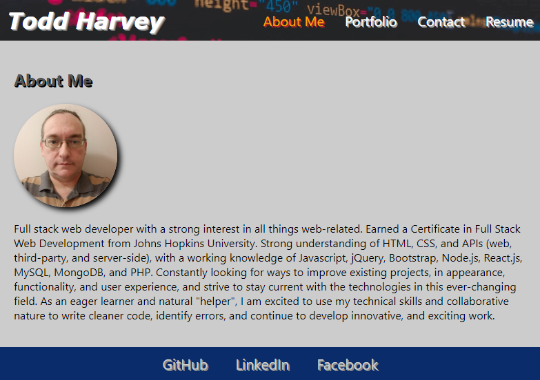

# React Portfolio

## Description
In this project, I created a portfolio to display my completed web development projects. This was built using ```React```, and the style layout is mobile-first.

The navigation links in the header go to the appropriate sections without refreshing the page.

The page is responsive, and portions of the page (```<header>```, ```<nav>```, and the projects in the "Portfolio" section) move or resize to adjust to different display sizes.

The titles, languages, and link for the projects are initially hidden, but transition to fully opaque when a project image is hovered over, and fade away once the mouse is moved away from the image.

The contact form is now functional.

## Project Link
The project can be viewed at <https://tharveyster.github.io/react-portfolio/>.

## Screenshot


## License
Copyright 2021 Todd Harvey

Permission is hereby granted, free of charge, to any person obtaining a copy of this software and associated documentation files (the "Software"), to deal in the Software without restriction, including without limitation the rights to use, copy, modify, merge, publish, distribute, sublicense, and/or sell copies of the Software, and to permit persons to whom the Software is furnished to do so, subject to the following conditions:

The above copyright notice and this permission notice shall be included in all copies or substantial portions of the Software.

THE SOFTWARE IS PROVIDED "AS IS", WITHOUT WARRANTY OF ANY KIND, EXPRESS OR IMPLIED, INCLUDING BUT NOT LIMITED TO THE WARRANTIES OF MERCHANTABILITY, FITNESS FOR A PARTICULAR PURPOSE AND NONINFRINGEMENT. IN NO EVENT SHALL THE AUTHORS OR COPYRIGHT HOLDERS BE LIABLE FOR ANY CLAIM, DAMAGES OR OTHER LIABILITY, WHETHER IN AN ACTION OF CONTRACT, TORT OR OTHERWISE, ARISING FROM, OUT OF OR IN CONNECTION WITH THE SOFTWARE OR THE USE OR OTHER DEALINGS IN THE SOFTWARE.

## Contact Info
Email: todd@weloveeats.com
